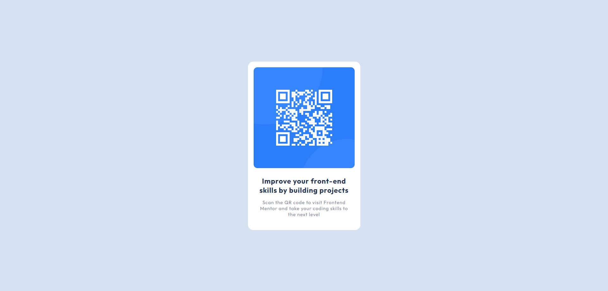

# Frontend Mentor - QR code component solution

This is a solution to the [QR code component challenge on Frontend Mentor](https://www.frontendmentor.io/challenges/qr-code-component-iux_sIO_H). Frontend Mentor challenges help you improve your coding skills by building realistic projects. 

## Table of contents

- [Overview](#overview)
  - [Screenshot](#screenshot)
  - [Links](#links)
- [My process](#my-process)
  - [Built with](#built-with)
  - [What I learned](#what-i-learned)
  - [Continued development](#continued-development)
  - [Useful resources](#useful-resources)
- [Author](#author)
- [Acknowledgments](#acknowledgments)

## Overview

### Screenshot



### Links

- Solution URL: [Add solution URL here](https://your-solution-url.com)
- Live Site URL: [Site URL](https://ra-qr-component.netlify.app)

## My process

### Built with

- Semantic HTML5 markup
- CSS custom properties
- Flexbox

**Note: These are just examples. Delete this note and replace the list above with your own choices**

### What I learned

In this project I learned how to create custom properties and used them inside the var() functions. I understood the basics of Flexbox, and how divs can help you wrap your content in order to style your components better. I want to mention the fact that I wasn't getting the result I was expecting with the QR component because I hadn't added this line of code:

```css
body {
 height: 100vh;
}
```
The QR component wasn't centered, so with that line of code you are setting the height of the body page to be 100% of the viewport height.

### Continued development

I would like to continue focusing on using Flexbox, and custom CSS properties in order to understand them better. 

### Useful resources

- [CSS-TRICKS](https://css-tricks.com/snippets/css/a-guide-to-flexbox/) - This helped me understand better the Flexbox. I really liked this pattern and will use it going forward.
- [mdn web docs](https://developer.mozilla.org/en-US/docs/Web/CSS/CSS_flexible_box_layout/Basic_concepts_of_flexbox) - This page was helpful to understand Flexbox as well.

## Author

- Frontend Mentor - [@Rakiit](https://www.frontendmentor.io/profile/Rakiit)
- Twitter - [@ricardoiarced](https://twitter.com/ricardoiarced)

## Acknowledgments

I want to give some part of the credit to these videos.
- Mr Coder - [First video](https://www.youtube.com/watch?v=5BBYPntB-GY&ab_channel=MrCoder)
- TsbSankara - [Second video](https://www.youtube.com/watch?v=JFyMWwOxHYM&t=913s&ab_channel=TsbSankara)

